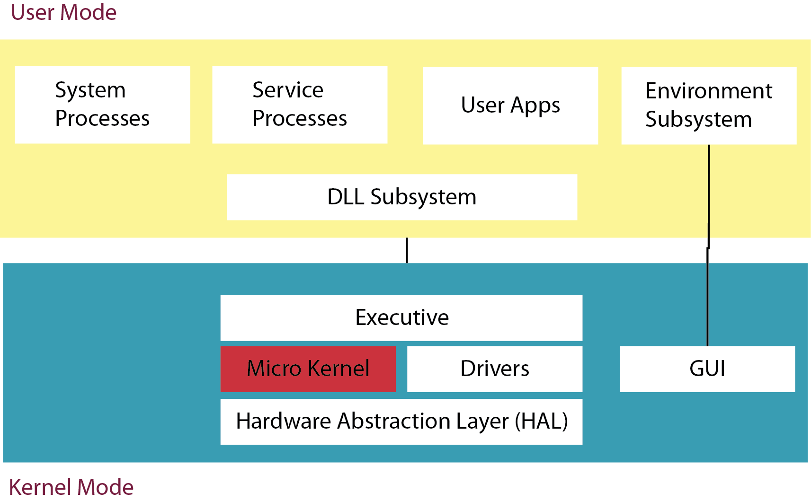

##Universidad de las Américas Puebla
###Operating Systems

Prof. Juan Carlos Galán Hernández

- Contact:
  + e-mail: <juan.galan@udlap.mx>
  + Room: LA-202
  + Website:
////
####Scoring:
  * 60% Exams
  * 25% Homework
  * 15% Final proyect
///
#####Final Proyect: To create a wav or mp3 player using basic API calls
  - Multimedia libraries cannot be used
  - A file digester for the selected file format must be implemented
  - If mp3 is selected, an algorithm for decompression must be implemented
  - The need for a GUI interface will be decided later on
  - The file must be start almost instantly
  - It has to use RAM memory efficiently
////
###Learning outcomes

+ What is an operating system
+ How an operating system works
+ How the operating system is related to the hardware
+ Architecture of current dominant operating systems
+ Learn the basic API calls
///
#####Operating System Kernels
+ Windows
+ Linux
+ MacOS
+ Android
+ iOS
////
#### Tools needed
+ Microsoft Windows
+ GNU/Linux o Mac OS X
+ Microsoft Visual Studio
+ GNU toolchain
+ Windows SDK
+ Oracle JVM o OpenJVM
+ Virtualbox
////
Chapter 1
=============
###Introduction
_____________

1. Computer Architecture Overview
2. Tasks of an Operating System
3. Operating System Architecture
4. Operating Systems
////
+ Operating Systems is an essential part of computing
+ Without operating systems, todays computing advances would be impossible
+ What is an operating system?
+ What does it do?
> It is hard to pin down what an operating system is
>
> **Andrew S. Tannenbaum in Modern Operating Systems; Prentice Hall; 3 ed.; 2007**

////
<section>

<h4> How we came up with the idea of a *computer*? </h4>

</section>
<section data-background="pics/BRL61-0560.jpg">
 
 In order to understand what an Operating System is, we must understand the idea behind computer hardware 

 
 Computers and other related deviced such mobile phones are based on a mathematical construct

 
 Alan Turing defined this hypotethical device in 1936 known as the Turing Machine

</section>
////
####A representation of a turing machine

////
####How a turing machine operates?
+ 
The head advances one place

+ 
The symbol is read

+ 
The state machine changes its state according to the symbol read

////
####How a microprocessor *mimics* a TM?
+ The tape is usually the Random Access Memory **RAM** because of its fast read/write speed
+ The head is a special element of the processor called Program Counter **PC**
+ The state machine are the rest of the processor elements such as registers, **ALU**, **Control Logic**, etc.
////
##Tasks of an Operating Systems
_________________
////
### Main tasks
#### The tasks of an operating systems depends on:
+ Hardware Target
+ Deployment
+ Objectives
////
#### Overall Objetives:
+ Provide tools for development, called **API**
+ Managment of hardware resources
////
#### The Operating System architecture target is not the regular user
* The Operating System is just an abstraction layer
////
<section>
<h4>Types of Operating Systems</h4>
</section>
<section data-background="pics/mainframe.jpg">
<h2>Mainframes</h2>
</section>
<section data-background="pics/mobile_devices_lrg.jpg">
<h2>Movile Devices<h2>
</section>
<section data-background="pics/rover.jpg">
<h2>Real Time</h2>
</section>
<section data-background="pics/Electronics-board.jpg">
<h2>etc...</h2>
</section>
////
The operating systems are packed with high level apps

Such apps are end user oriented

+ Basic text editor
+ A scripting languaje
+ a shell
+ ...
////
#####Our discussion will be focused on three main tasks
+ Memory management
+ CPU time management
+ Inter process Communication Mechanism (**IPC**)
////
## Operating System Architecture
________
////
Operating System design is focused on the *Operating System Kernel*

The kernel is where all basic services are stored

The kernel must provide an environment for the target user (a developer) can operate the hardware at API level
////
####There are four kinds of kernels
+ Monolithic kernel
+ Microkernel
+ Nanokernel
+ Exokernel
////
But...
We have to discuss something first
///
The security concept of *Ring*

///
Nowaday, the security ring is implementes at hardware level
///
A service running on a given level n>0 is not allowed to modify a service on running on a lower layer
///
The security ring allows to implement a multiuser environment
///
####However, only two levels are used:
+ Level 0, kernel mode
+ Level 1, user mode, user land
////
Let's go back to kernel types
////
####Monlithic kernel
####Everything runs inside kernel mode
////
####Micro kernel
####Only basic services run in kernel mode
+ Memory management
+ CPU Scheduling
+ Basic IPC
////
####Nanokernel
+ Neither standard nor official definition
+ Sensors like hardware
////
####Exokernel
+ Close-to-metal hardware access
+ Academic development
+ MIT
+ Cambridge
////
####There is an extra unofficial type:
####Hybrid kernel
####Monolithic + Micro
////
###Monolythc vs Micro kernels

////
###Exokernel

////
##Operating Systems
___________________
////
###Windows => Windows {Phone, CE, Mobile}
###Linux => Android
###Mac OS X => iOS
////
+ Por qué conocer la arquitectura básica?
+ Conocer los orígenes es también un factor
+ Diferentes arquitecturas
  + x86
  + x86_64 (AMD64, ET64)
  + PowerPC (ppc)
  + ARM
////
###Windows
////
+ Nació con la PC
+ Desarrollado para el usuario doméstico
+ Enfoque en interfaces y aplicaciones de oficina
////
####Versiones
+ QDOS
+ MS-DOS / PC-DOS
+ Windows 3.1 3.11 - Windows ME
+ Windows NT (Servidores)
+ Windows XP
+ Windows //Vista
+ Windows 7/8
////
+ Monolithic Kernel -> Hybrid Kernel
+ Desarrollo Fragmentado
+ Compleja portabilidad
+ Actuales intentos de unificación de plataformas
+ Ultimas versiones basados en .NET
+ Estandarizó Interfaces
+ Asentó la arquitectura x86
////

////
###Linux & Android
////
####Basado en Unix
+ Unix fue desarrollado en la academia
+ Retomado por AT&T
+ El objetivo de unix son los servidores
+ Las PC no formaban parte del ecosistema
////
+ Linux es creado en los 90
+ Monolithic -> Hybrid Kernel
+ Basado en Unix RVS y Minix
+ Creado por Linus Torvals et al.
+ Patrocinado por la Free Software Foundation (Richard Stallman)
////

////
####Android
////
+ Desarrollado por Google
+ Basado en Linux (fork)
+ No es el único S. O. Móvi basado en Linux
////
+ Utiliza una JVM como segunda capa de abstracción
+ Ayuda a implementar el concepto de sandbox
+ La JVM se llama Dalvik, desarrollada por Google
+ Implementación parecida a Windows Phone 7/8 y .NET
////

////
###Mac OS X & iOS
////
+ Antes de 1999 arquitectura basada en PowerPC
+ Desplazado en ventas por Intel y AMD
+ Steve Jobs había renunciado para 1999
////
+ Steve Jobs funda NeXT Technologies
+ Desarrolla un nuevo sistema operativo
+ Se basa en March y Minix
+ El nombre dl S.O. fué NeXTStep
////
+ Apple adquiere NeXT Technologies
+ Coloca a Steve Jobs como CEO por segunda vez
+ Adquiere las patentes de NeXTStep
+ Fusiona NeXTStep con Mac OS
+ Nace Mac OS X
////
+ Basado en unix (Mach + BSD)
+ Completamente compatible con  POSIX
+ El kernel es llamado Darwin y es Open Source
+ El API esta basado en Objetive C
+ El API para desarrollo se llama Cocoa
////

////
+ iOS es en escencia el mismo sistema operativo
+ Elementos diferentes:
  + Interfaz (Spring board)
  + Sistema de Archivos
////
##Bootloader
###What happen when the computer is turned on?
////
+ In the mid 70s IBM starts the *chess project*
+ The IBM-Microsoft joint adventure delimited the booting routines for PCs
////
###The boooting process is know as bootstrap
###Bootstrap can be seen as three step process:

+ Hardware initialization
+ Operating system loading
+ Operating system initialization
////
####The BIOS is responsible for the first two steps
####We used the same BIOS (mostly) until 2010
####The new standard is known as EFI and is being adopted for new hardware
////
###Hardware Initialization

+ Initialize on board hardware
+ Initialize I/O
+ Establish IRQ
////
###Operating System Loading

#### The second step is to load the *bootloader*
////
Running the bootloader is done by the BIOS

+ The BIOS looks into the sector 0 of each media
+ The whole sector is read (512 bytes)
+ Checks for the signature
////
####Bootloader Signature
////
+ The sector 0 is also known as *Master Boot Record (MBR)*
+ The MBR is different on each media
+ A floppy disk has the 512 bytes available
+ An HDD only has 440 bytes available
  + The missing bytes store partition information
////
In order to create a basic bootloader, we have to meet a few requirements:

+ The size must be 512 - 2 bytes (because of the signature)
+ Our bootloader must be on 16 bits mode
+ Because of the mode, we only have access to 64kb
+ It must have the signature at the end of the bootloader (0xAAFF)
+ Our bootloader will be loaded at the 0x7C00 address by the BIOS
////
#### Why 0x7C00?

+ The first IBM PC with a bootloader was the IBM PC 5150
+ It had 32KB
+ 0x7C00 is the address of the begining of the last kilo byte on 32 KB
////
####Let's build a bootloader

+ It should be really simple
+ It will only bootup the pc and print and A character
+ It will be implemented for floppy disks
////
####Tools we will need:

+ nasm: sudo apt-get install nasm
+ dosfstools: sudo apt-get install dosfstools

####Setting up a Virtual Machine with VirtualBox for our bootloader
////
#### Our bootloader
<pre><code data-trim>
[BITS 16]
[ORG 0x7C00]

MOV AL, 65
CALL PrintCharacter
JMP $

PrintCharacter:
MOV AH, 0x0E
MOV BH, 0x00
MOV BL, 0x07

INT 0x10
RET

TIMES 510 - ($ - $$) db 0
DW 0xAA55
</code></pre>
////
####Compiling our bootloader:

    nasm aboot.asm -f bin -o boot.bin
////
####Creating a floppy disk

    mkfs.dos -C floppy.img 1440
    sudo losetup /dev/loop0 floppy.img
    sudo dd if=boot.bin bs=512 of=/dev/loop0
    sudo losetup --detach /dev/loop0

////
####Then we boot up our virtual machine
////
####Project Set up
////
####Tools to be used

+ Oracle JDK
+ Eclipse
+ Maven

////
####Setting up: JDK

+ Set up JAVA_HOME
+ Set up Path (Windows)
////
####Setting up: Eclipse

+ Just install
////
####Setting up: Maven

+ Set up M2_HOME
+ run mvn -Declipse.workspace=<path-to-eclipse-workspace> eclipse:add-maven-repo
