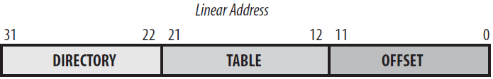
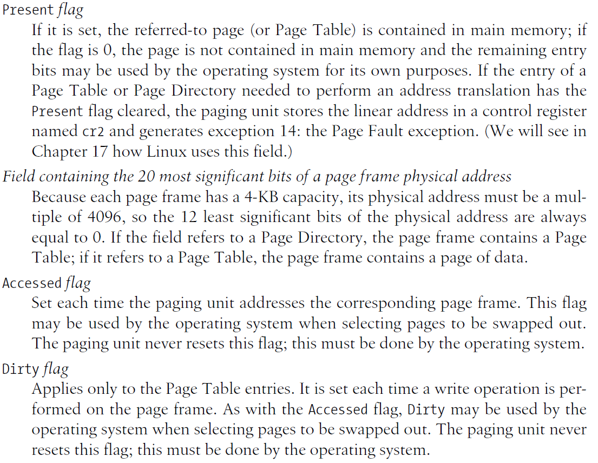
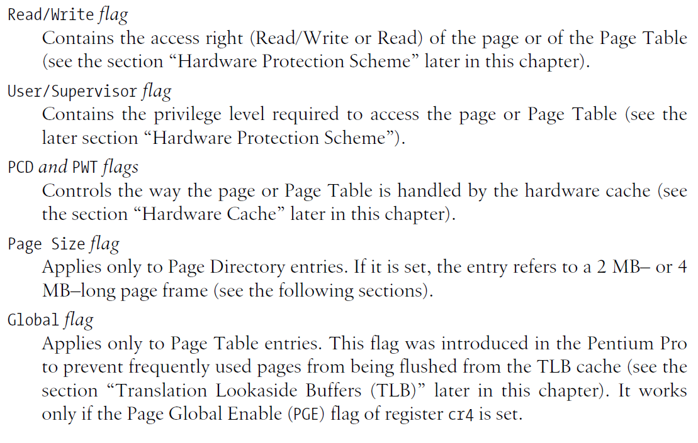
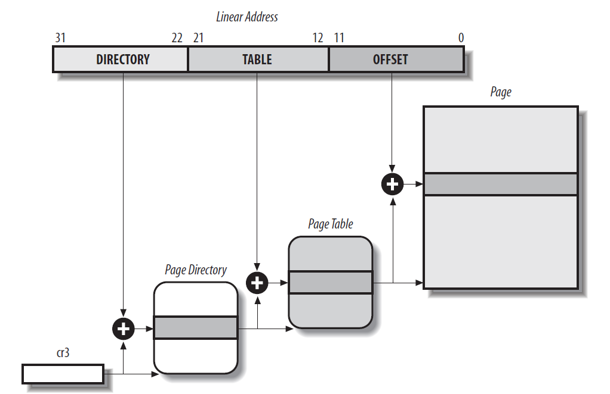

##Memory Management
////
+ There are different ways to handle memory
  + Direct Access (MS-DOS)
  + Managed Memory
////
####Virtual Memory management benefits

  + Security
  + Transparency
  + Eficiency
  + Multi-programming
  + Flexibility
////
####Virtual Memory is supported through hardware

+ Hardware handles the memory addressing
+ Current hardware uses the Von Neuman memory model
  + Data and Code shares the same memory addressing
////
###Memory Addressing

  + Memory is handled by the Memory Management Unit (MMU)
  + MMU can handle memory in two ways:
    + Real Mode
    + Protected Mode
////
  + Real Mode. Direct access to memory physical address (bootloader)
  + Protected Mode. Three types of address:
     + Physical Address
     + Linear Address
     + Logical Address
////
####Each CPU has implemented a *Memory Arbiter*
####The Memory Arbiter manages the CPU access to RAM and Direct Memory Access (DMA) units
////
####Each memory address type refers to a different way to handling memory

+ Logical Address uses segmentation
+ Linear Address, also called Virtual Address uses Paging

####In order to obtain the physical address, the Operating System must calculate both methods on modern PCs
////
##Segmentation
////
+ Segmentation was introduced since the Intel 80286
+ It was the first method for virtual memory implementation
////
+ A Logical Address used on 32 bits architecture is done using 48 bits
  + The first 16 bits are called a *segment selector*
  + The last 32 bits are called *offset*
////
+ The offset is just an unsigned integer that stores how many memory addresses is a given location from the start of the segment
+ Starting from the Most Significant Bit (MSB), the structure of the Segment Selector is:
  + Bits 15-3 are called index
  + Bit 2 is the Table Descritor
  + Bit 1-0 the permission level
////
+ When a process is being executed by the CPU, three segments are assigned to it:
  + Code Segment, stored on cs
  + Data Segment, stored on ds
  + Stack Segment, stored on ss
+ There are three more segment registers for general use:
  + es
  + fs
  + gs
////
####In order to speed up linear address computation from a logical address, the CPU keeps a *segment descriptor*
////
+ A segment descriptor is needed for each logical address
+ Segment descriptors are stored on a Global Descriptor Table (GDT) or on a Local Descriptor Table (LDT)
////
+ Each CPU has its own GDT, its address is stored in a special register called *gdtr*
+ Each process can have one LDT, when a process is executed, the addres of the LDT is stored in the *ldtr* register
////

////
+ There are four kinds of segment descriptor:
  + Code Segment Descriptor
  + Data Segment Descriptor
  + Task Segment Descriptor
  + Local Table Table Descriptor
////
### Linear Address Calculation Algorithm

+ Check the TL field of the Segment Selector
+ Index times 8 plus the GDT or LDT address
+ Add the offset to the linear address stored on the segment descriptor
////
###Paging
////
+ Paging is another Virtual Memory Model
+ It uses small memory blocks called Pages
////
+ Page characteristics:
  + All linear addresses inside a page are contiguous
  + It's size is 4096 bytes
  + A process can have multiple pages
////
+ The pages are hardware managed by the *Paging Unit*
+ The physical memory (RAM) is also splitted in units of 4KB
+ The physical blocks are called Page Frames
////
+ Each page frame can hold only one Page
+ A page can be seen as a set of data and a page frame as a block of free memory
////
+ The data blocks inside a Page are identified by linear addresses
+ The linear address must be translated to a physical address by the CPU in order to retrieve the stored value
////
+ There are two main ways to handle the linear addresses on the 32 bits x86 architecture
  + Paging: The linear address is splitted in three blocks
  + Extended Paging: The linear address is splitted in two blocks
+ Each address split is known as *level*
////
####Structure of a linear address using the paging method

////
####Table of the paging flags

////
####Table of the paging flags

////
+ Each Page level points to a *Page Table*
+ The page table structure  is related to the Segmentation Tables
+ Each page table holds the address to either another page table or to a physical address.
////
####Diagram of a Page Table

////
+ The main advantage of Paging over Segmentation is better *swapping*
+ Swapping is the action of moving Pages from RAM memory to another cheaper storage unit.
////
+ Swapping allows the computer to increase the available RAM in a way
+ When a Page is *old enough* and a free page frame is needed, the CPU can allocate the old page in another storage unit like a HDD or a SDD
////
+ How the CPU calculate the *age* of a page?
  + Checks for the Dirty flag
  + Checks for the Accessed flag
  + Date Bookkeeping
////
+ What happen when a process already in "memory" looks for a page that has been swapped?
  + The CPU will try to find it on RAM
  + Then a *Page Fault* exception is raised
  + Next, the paging unit will look for the missing page on the Swapping file/drive/parttition
  + The paging unit will swap an old Page for the requested one and pass the new address to the CPU
////
+ Extended Paging was introduced on since the Pentium models.
+ It used only two levels instead of three
+ This allows to handle bigger pages of 4 MB each
+ Bigger pages have better performance when bigger files are being handled by a process
////
###The +4GB problem
////
+ Because the RAM memory became cheaper, more and more PCs were being build with more than 4GB of ram
+ However, the way it was, Paging could handle less than 4GB of memory
+ The solution was to *improve* paging with a mechanism called Physical Address Extension (PAE)
////
+ PAE was introduced on the Petium Pro and onwards
+ It extended the Page table entries from 32 to 64 bits
+ The new linear addresses use 36 bits instead of 32
+ In PAE, four levels are used for paging
////
+ On 64 bit architecture, PAE is not needed
+ The levels for paging on 64 bits depends on the architecture
+ x86_64 uses four levels with linear address of 46 bits
////
###Caching
+ RAM memory is one of the fastest storage media on the computer
+ However, the CPU is faster
+ The speed difference means wasted time for the CPU
////
+ Using higher speed RAM is better for performance, however it could become prohibitive because of the price
+ The solution was to include inside the CPU a faster but smaller RAM (Static RAM)
+ This extra RAM, also known as Cache RAM has a few advantages over the main RAM memory
////
+ Cache Advantages:
  + Using SRAM is faster than DRAM (Dynamic RAM)
  + It's closer to the CPU, so data needs to travel less distance
////
+ Because Cache is smaller, it must be handled different than RAM with Virtual Memory
+ It's function is based in the *Principle of Locality*
////
###The Principle of Locality

> If a particular memory location is referenced at a particular time, then it is
> likely that nearby memory locations will be referenced in the near future. In
> this case it is common to attempt to guess the size and shape of the area
> around the current reference for which it is worthwhile to prepare faster
> access the ones close to it.

////
+ The cache is splitted in blocks called *lines*
+ A line can hold several memory blocks
+ The cache is also accessed by the Paging Unit
////
+ When the CPU request a memory address, it checks the Cache first
+ If it is not in cache, a *cache miss* is rised
+ Then the paging unit looks for it in RAM
+ Finally the paging unit loads the memory address and the closer ones in a *line*
////
+ If the memory address is on the Cache, a *cache hit* is rised
+ An address can be stored on multiple lines
+ A system with several CPUs must coordinate the cache of each CPU
////
+ There are two ways of synchronization of Cache-Main Memory:
  + Write Through: When a locality is writed, the cache controller writes it in both the cache and the RAM memory
  + Write Back. The locality is only updated in the cache. The memory is updated at a*flush* event
////
+ Whith multiple CPUs, each cache controller checks on a *flush* if other CPUs has the same address on its cache and request an update if found.
+ This is known as *cache snooping*
////
+ There are several levels of cache:
  + L1
  + L2
  + L3
  ...
+ The L1 level is the faster and smaller one, as the level increases, the memory speed decreases but the size gets bigger
+ The operating system can choose to manage each level separately or as a whole
////
+ There is a second no programmable cache
+ This cache is known as the Translation Lookaside Buffer (TLB)
+ This cache holds the physical address of each linear address inside the cache
