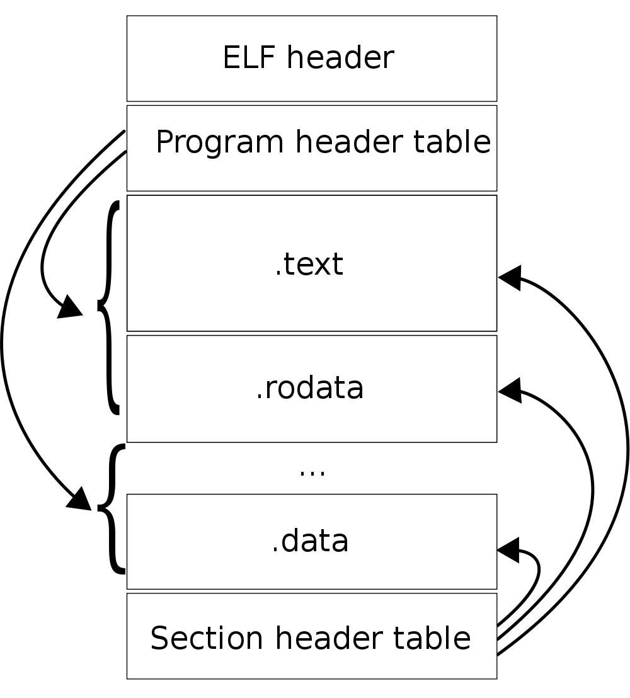
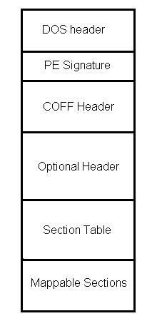

##3. Processes
////
+ A process has several names
  + Windows: Process
  + Linux/Unix: Task or Thread
////
##General Definition
> A process is an instance of a program
> that is being executed
////
+ The operating system has the rsponsability of
  creating processes and managing the CPU time
+ Current operating systems allow multiple process at a given time
////
+ Allowing multiple processes is called multi-tasking
+ Multi-tasking on a single CPU core is done via time-sharing
////
###Program Structure
+ In order to create a process, the operating system must allocate resources for the process
+ The needed resources must be known beforehand
+ This is done using headers
////
+ A header is what makes a binary file an executable program
+ Windows also uses file extensions, but on Unix this is not needed
+ There are several formats of executable files
////
+ Common executable file formats:
  + Unix:
    + Executable and Linkable Format (ELF)
  + Windows:
    + COM (.com)
    + Portable Executable or just PE (.exe)
  + Mac OS X:
    + Mach-O
////
####ELF

////
####PE

////
####Mach-O

